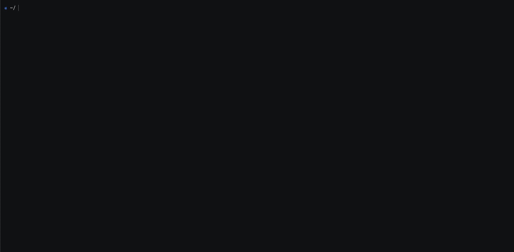

<div align="center">

# pierx

Tunnel direct. No relay. No limits.



[](https://go.dev/)
[](LICENSE)
[](https://github.com/pajarori/pierx/stargazers)
[](https://github.com/pajarori/pierx/network/members)
[](https://github.com/pajarori/pierx/issues)
[](https://github.com/pajarori/pierx/commits/main)

</div>

## Installation

```bash
go install github.com/pajarori/pierx@latest
```

or download from [releases](https://github.com/pajarori/pierx/releases).

## Usage

```bash
# Expose a local HTTP app
pierx http 3000

# Expose a local TCP service like SSH
pierx tcp 22

# Restrict allowed source IPs for TCP tunnels
pierx tcp 22 --allow 1.2.3.4/32 --allow 10.0.0.0/8
```

## Options

| Flag | Description |
|---|---|
| `--port` | Local port to expose |
| `--allow` | Allowed source IPs or CIDRs for TCP tunnels |

## License
 
MIT License